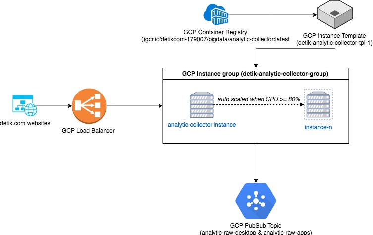

# Analytic Collector

Simple http server to collect http request data from all detikcom websites

## Technology Stack

1. Go 1.8
2. Glide [glide.sh](http://glide.sh)
3. GOA [goa.design](http://goa.design)
4. Google PubSub 

## Development

please ensure that `make` are installed on your computer

Mac:
```
$> make install-mac
$> ./run_collector.sh
```

Linux
```
$> make install-linux
$> ./run_collector.sh
```

## Application Architecture

### Architecture



### Configurations

#### GCP Container Registry

Image name: `gcr.io/detikcom-179007/bigdata/analytic-collector:latest`

##### GCP Instance Template

* Container Image: `gcr.io/detikcom-179007/bigdata/analytic-collector:latest`
* Restart Policy: `Always`
* Environment variables:
    * ANALYTIC_COLLECTOR_SOCKET=`tcp://0.0.0.0:8080`
    * ANALYTIC_COLLECTOR_GCP_TOPIC_GET_ID=`analytic-raw-desktop`
    * ANALYTIC_COLLECTOR_GCP_TOPIC_POST_ID=`analytic-raw-apps`
    * ANALYTIC_COLLECTOR_PARSER_MAX_WORKER=`200`

#### GCP Instance Group

* Port name mapping: all incoming is directed to port `8080`
* Instance template: *instance template name*
* Minimum number of instance: `2`
* Maximum number of instance: `5`
* Setup health check on **GCP Health checks**

#### GCP PubSub

Create two topics for `desktop` and `apps`, there're:

* `analytic-raw-desktop`
* `analytic-raw-apps`

#### GCP Load Balancer

* Instance group: `detik-analytic-collector-group` (choose instance group that created from step above)

#### Deployment

GCP Container Registry authentication: [https://cloud.google.com/container-registry/docs/advanced-authentication](https://cloud.google.com/container-registry/docs/advanced-authentication)

```bash
$> docker login dregistry.detik.com:5000
$> Username: <input username>
$> Password: <input password>
$> docker pull dregistry.detik.com:5000/bigdata/analytic-collector:<tag>
$> docker tag dregistry.detik.com:5000/bigdata/analytic-collector:<tag>  gcr.io/detikcom-179007/bigdata/analytic-collector:latest
$> docker push gcr.io/detikcom-179007/bigdata/analytic-collector:latest
```

after analytic-collector image pushed to google container registry, update instances to use latest image [https://cloud.google.com/compute/docs/instance-groups/updating-managed-instance-groups](https://cloud.google.com/compute/docs/instance-groups/updating-managed-instance-groups)

## GCP Service Account

This project needs a Service Account from GCP to store the data to PubSub, the Service Account should has the following roles:

* Pub/Sub Editor
* Pub/Sub Publisher
* Pub/Sub Subscriber
* Pub/Sub Viewer
* Storage Admin
* Storage Object Viewer